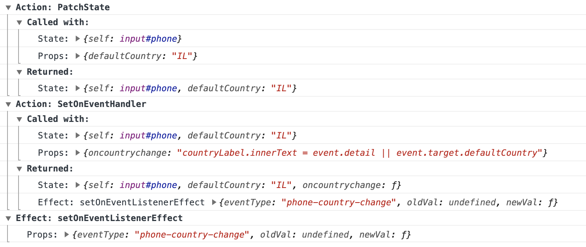

# Hyperapp Debug Trace

Traces all dispatched Hyperapp actions and effects.

- Logs the state and properties arguments with which every action is dispatched.
- Parses and logs the return value of every action.
- Logs the properties argument with which every effect is dispatched.

For example:



## Installation

```
npm install hyperapp-debug-trace
```

## Usage

Import `traceDispatch` and pass it to Hyperapp as middleware.

```javascript
import { app } from 'hyperapp';
import { traceDispatch } from 'hyperapp-debug-trace';

app({
  init: initialState,
  view: appView,
  subscriptions: subscriptionsFn,
  middleware: traceDispatch,
  node: appElement,
});
```

## Tips

- Define your actions and effects as named functions (i.e. not anonymous). This
  will make the trace output much more informative.
- When minifying an app with tracing enabled, preserve the function names of
  your Actions and Effects. (For example, this can be done with
  Terser using the [keep_fnames](https://github.com/terser/terser#user-content-minify-options:~:text=regex.-,keep_fnames)
  setting.)
